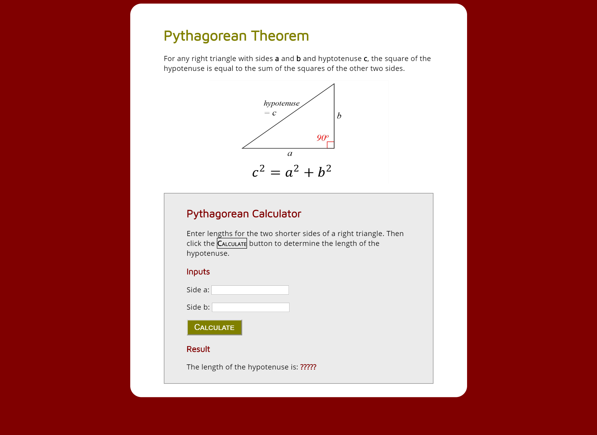

<!-- # web-dev-pythagorean-calculator
Design Resources for Pythagorean Theorem Web Dev Assignment

<h2>Screen Shot</h2>

<h2>Style Notes</h2>

<h3>Page Layout</h3> -->
<!-- 
Use a centered-fixed-width layout: page-content-width=600px (75px padding on either side)
 -->
<!-- 
Calculator box has a top and bottom padding of 10px and left and right padding of 50px
 -->

<h3>Fonts</h3>
<ul>
  <!-- <li>base font is 'Open Sans' (from Google Fonts)</li> -->
  <!-- <li>All headings are 'Maven Pro' (from Google Fonts)</li> -->
  <!-- <li>Paragraphs have a letter-spacing of 0.3px</li> -->
  <!-- <li>Little calculate span box is small-caps and bold</li> -->
  <!-- <li>Big Calculate button is 18px and small-caps</li> -->
  <!-- <li>Result Question Marks are bold</li> -->
</ul>

<h3>Colors</h3>
<ul>
  <!-- <li>Page background color is maroon</li> -->
  <!-- <li>Pythagorean Calculator box background-color is rgb(235, 235, 235) and a grey border</li> -->
  <!-- <li>Main Heading (h1) is #808000</li> -->
  <!-- <li>Sub Headings (h2, h3) are maroon</li> -->
  <!-- <li>Big Calculate Button background color is #808000</li> -->
  <!-- <li>Result Question Marks are maroon</li> -->
</ul>

<h3>Links</h3>
<ul>
  <!-- <li>Triangle Image: "http://www.etudes.ru/en/etudes/pythagorean-theorem/"</li> -->
</ul>
<!-- 
When you click the image, open link in a new tab/window
 -->
<!-- 
Add a black border to image on hover
 -->
  
  
